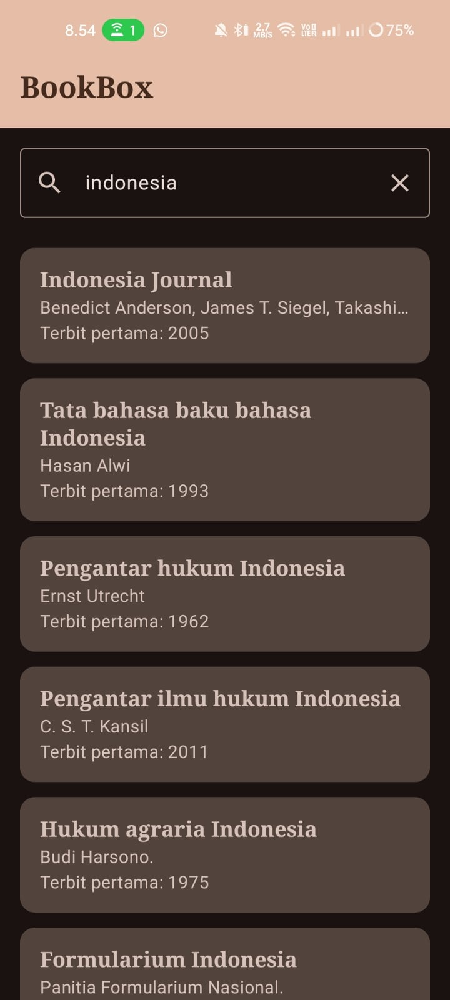
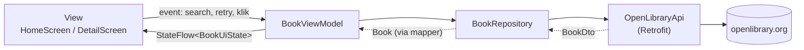

# 📚 BookBox

Aplikasi Android untuk mencari dan menjelajahi katalog buku dari **OpenLibrary API**. Dibuat untuk **Responsi Mobile Programming, Paket 2: Aplikasi Katalog dan Eksplorasi Buku OpenLibrary**.

Aplikasi mengambil data buku dari REST API secara dinamis, lalu menampilkannya dengan Jetpack Compose menggunakan arsitektur MVVM.

| | |
|---|---|
| Nama aplikasi | BookBox |
| Package | `com.example.bookbox` |
| Min SDK | 24 |
| Bahasa | Kotlin |
| UI | Jetpack Compose + Material Design 3 |
| Arsitektur | MVVM (View, ViewModel, Repository, API Service, Data Model) |

**Pembuat:** `Raja Arcenio Ravi Hussain` · `H1D024092`

---

## 📸 Screenshot

| Home Screen | Detail Screen |
|:---:|:---:|
|  |  |
| Search bar dan daftar buku | Informasi lengkap buku terpilih |

---

## ✨ Fitur

**Home Screen**
- Judul aplikasi pada `TopAppBar`.
- **Search bar**: pencarian buku berdasarkan kata kunci (parameter `q` pada API). Pencarian dijalankan dengan tombol search pada keyboard atau ikon kaca pembesar. Tersedia tombol hapus teks.
- **Daftar buku** dengan `LazyColumn`, berisi judul, nama penulis, dan tahun terbit pertama. Tanpa gambar sampul.
- Saat aplikasi dibuka, daftar langsung terisi dengan kata kunci awal `indonesia`.

**Detail Screen**
- Menampilkan judul, penulis, tahun terbit pertama, jumlah edisi, dan bahasa.
- Tombol back pada `TopAppBar`.
- Data berasal dari item yang diklik di Home (tidak ada API call kedua).

**State UI**

| State | Tampilan |
|---|---|
| Loading | Indikator progres + teks "Memuat buku..." |
| Success (ada data) | Daftar buku |
| Success (kosong) | Pesan "Buku tidak ditemukan" |
| Error | Pesan kesalahan + tombol **Coba Lagi** |

**Tema**
- Material Design 3 dengan palet warna kustom, mendukung **Light dan Dark mode**.
- Tipografi kustom (judul memakai font Serif).

---

## 🏗️ Arsitektur

Aplikasi memakai pola **MVVM** dengan aliran data satu arah (*unidirectional data flow*).



| Layer | Komponen | Tanggung jawab |
|---|---|---|
| **View** | `HomeScreen`, `DetailScreen`, komponen reusable | Menampilkan UI berdasarkan state. Tidak memanggil API. |
| **ViewModel** | `BookViewModel` | Menyimpan query dan `uiState`, menjalankan pencarian di `viewModelScope`. |
| **Repository** | `BookRepository` | Memanggil API, memetakan DTO ke model UI, membungkus hasil dengan `Result`. |
| **API Service** | `OpenLibraryApi`, `RetrofitClient` | Definisi endpoint Retrofit dan konfigurasi Retrofit + Gson. |
| **Data Model** | `BookDto`, `Book`, `Mapper.kt` | `BookDto` mengikuti response API, `Book` dipakai UI. |

### UI State (sealed interface)

```kotlin
sealed interface BookUiState {
    data object Loading : BookUiState
    data class Success(val books: List<Book>) : BookUiState
    data class Error(val message: String) : BookUiState
}
```

`BookViewModel` mengekspos `StateFlow<BookUiState>`. Composable mengamatinya dengan `collectAsState()` dan memilih tampilan lewat `when (state)`, sehingga setiap perubahan state langsung memicu *recomposition*.

### Alur pencarian

1. Pengguna mengetik kata kunci, `onQueryChange()` memperbarui `query` (StateFlow).
2. Pengguna menekan search, `search()` membatalkan pencarian sebelumnya (jika ada) lalu mengubah state menjadi `Loading`.
3. `BookRepository.searchBooks()` memanggil API, mengubah `BookDto` menjadi `Book`, dan mengembalikan `Result`.
4. Hasil dipetakan ke `Success` atau `Error` (pesan ramah pengguna lewat extension `Throwable.toUserMessage()`).
5. UI menampilkan sesuai state.

### Alur navigasi ke Detail

Navigasi memakai `navigation-compose` dengan 2 destinasi: `home` dan `detail`. Saat item diklik, objek `Book` disimpan pada `savedStateHandle` milik back stack entry Home, lalu `DetailScreen` membacanya dari `previousBackStackEntry`. Karena objek yang dibawa sudah lengkap, **tidak ada API call kedua**. `Book` mengimplementasikan `Serializable` agar dapat dibawa dengan cara ini.

### Struktur folder

```
app/src/main/java/com/example/bookbox/
├── MainActivity.kt
├── data/
│   ├── model/
│   │   ├── BookDto.kt          # SearchResponse + BookDto (sesuai JSON API)
│   │   ├── Book.kt             # model untuk UI
│   │   └── Mapper.kt           # extension BookDto.toBook()
│   ├── remote/
│   │   ├── OpenLibraryApi.kt   # interface Retrofit
│   │   └── RetrofitClient.kt
│   └── repository/
│       └── BookRepository.kt
├── ui/
│   ├── BookUiState.kt
│   ├── BookViewModel.kt
│   ├── components/
│   │   ├── BookItem.kt
│   │   ├── BookSearchBar.kt
│   │   └── StateViews.kt       # LoadingView, ErrorView, EmptyView
│   ├── screens/
│   │   ├── HomeScreen.kt
│   │   └── DetailScreen.kt
│   ├── navigation/
│   │   └── AppNavHost.kt
│   └── theme/
│       ├── Color.kt
│       ├── Theme.kt
│       └── Type.kt
└── util/
    └── Extensions.kt           # Throwable.toUserMessage(), List<String>.toLanguageText()
```

---

## 🌐 API

Menggunakan [OpenLibrary Search API](https://openlibrary.org/developers/api). **Tidak memerlukan API key.**

| | |
|---|---|
| Base URL | `https://openlibrary.org/` |
| Endpoint | `GET /search.json` |
| Query | `q` (kata kunci), `limit=20`, `fields` (membatasi field agar response ringan) |

Contoh request:

```
https://openlibrary.org/search.json?q=indonesia&limit=20
```

Bentuk response yang dipakai (ilustrasi):

```json
{
  "docs": [
    {
      "key": "/works/OL12345W",
      "title": "Judul Buku",
      "author_name": ["Nama Penulis"],
      "first_publish_year": 2005,
      "edition_count": 12,
      "language": ["ind", "eng"]
    }
  ]
}
```

Pemetaan field:

| Field API | Dipakai untuk |
|---|---|
| `key` | ID buku (mis. `OL12345W`) dan key item `LazyColumn` |
| `title` | Judul buku |
| `author_name` | Penulis (digabung dengan koma) |
| `first_publish_year` | Tahun terbit pertama |
| `edition_count` | Jumlah edisi (Detail) |
| `language` | Bahasa (Detail) |

Field `cover_i` diabaikan sesuai ketentuan. Semua field pada DTO bersifat **nullable** karena API tidak menjamin kelengkapan data. Buku tanpa `key` atau `title` dilewati (`mapNotNull`). Penulis kosong ditampilkan sebagai "Penulis tidak diketahui", tahun kosong sebagai "-".

---

## 🛠️ Teknis

### Teknologi dan library

| Kebutuhan | Yang dipakai |
|---|---|
| Bahasa | Kotlin |
| UI | Jetpack Compose, Material Design 3 |
| Networking | Retrofit, converter-gson |
| Navigasi | navigation-compose |
| ViewModel | lifecycle-viewmodel-compose |
| Asynchronous | Kotlin Coroutines + StateFlow |

Library tambahan di luar bawaan template hanya empat: **retrofit, converter-gson, navigation-compose, lifecycle-viewmodel-compose**. Tidak ada library gambar. Versi dikelola lewat `gradle/libs.versions.toml`.

### Penerapan konsep Kotlin

| Konsep | Contoh penerapan |
|---|---|
| Data class | `Book`, `BookDto`, `SearchResponse`, `BookUiState.Success` |
| Null safety | Field DTO nullable, `?:`, `?.`, `orEmpty()`, `takeIf` pada `toBook()` |
| Lambda | Callback `onClick`, `onQueryChange`, `onRetry`, `onBookClick`, `mapNotNull { }` |
| Extension function | `BookDto.toBook()`, `Throwable.toUserMessage()`, `List<String>.toLanguageText()` |
| Sealed interface | `BookUiState` |

### Penerapan Compose dan Material 3

- **Scaffold + TopAppBar** pada kedua screen.
- **Composable layout**: `Column`, `Card`, `OutlinedTextField`.
- **Lazy layout**: `LazyColumn` dengan `key` stabil per item.
- **Reusable composable**: `BookItem`, `BookSearchBar`, `LoadingView`, `ErrorView`, `EmptyView`, `InfoRow`.
- **State hoisting**: komponen reusable bersifat stateless, state berada di ViewModel.
- **Theme**:
  - `Color.kt`: palet Light dan Dark.
  - `Theme.kt`: `lightColorScheme` dan `darkColorScheme`, mengikuti pengaturan sistem.
  - `Type.kt`: override `titleLarge`, `titleMedium`, `bodyMedium`.

### Penanganan error

| Kondisi | Pesan |
|---|---|
| Tidak ada koneksi / timeout (`IOException`) | "Gagal terhubung. Periksa koneksi internet Anda." |
| Response error server (`HttpException`) | "Server bermasalah (kode ...)" |
| Kata kunci kosong | "Kata kunci tidak boleh kosong." |
| Lainnya | "Terjadi kesalahan: ..." |

`CancellationException` diteruskan (tidak ditelan) agar pembatalan pencarian lama berjalan benar.

### Kesesuaian dengan ketentuan

| Ketentuan | Status | Lokasi |
|---|:---:|---|
| Kotlin: data class, null safety, lambda, extension | ✅ | `data/model`, `util` |
| Jetpack Compose, Material 3, reusable composable | ✅ | `ui/` |
| Modifikasi `Color.kt`, `Theme.kt` (Light/Dark), `Type.kt` (min. 2 override) | ✅ | `ui/theme` |
| Scaffold + TopAppBar | ✅ | `HomeScreen`, `DetailScreen` |
| List dengan `LazyColumn`, data dari API | ✅ | `HomeScreen` |
| Info list: judul, penulis, tahun; tanpa gambar | ✅ | `BookItem` |
| State: search, loading, error, UI berubah sesuai state | ✅ | `BookViewModel`, `StateViews.kt` |
| OpenLibrary tanpa API key, Retrofit + converter-gson | ✅ | `data/remote` |
| Permission INTERNET | ✅ | `AndroidManifest.xml` |
| Detail dari item terpilih via navigasi, tanpa API call kedua | ✅ | `AppNavHost` |
| MVVM + sealed UiState + StateFlow | ✅ | `ui/`, `data/` |
| Tidak ada API call langsung di Composable | ✅ | Composable hanya memanggil ViewModel |
| Maksimal 2 screen, tombol back di Detail | ✅ | `AppNavHost`, `DetailScreen` |
| Library hanya yang diizinkan | ✅ | `libs.versions.toml` |

---

## ▶️ Cara Menjalankan

**Prasyarat:** Android Studio (versi terbaru), JDK sesuai bawaan Android Studio, perangkat/emulator dengan koneksi internet.

```bash
git clone https://github.com/<username>/<nama-repo>.git
```

1. Buka folder hasil clone di Android Studio.
2. Tunggu Gradle sync selesai.
3. Pilih emulator atau perangkat fisik.
4. Klik **Run ▶**.

### Build APK debug

`Build → Build Bundle(s) / APK(s) → Build APK(s)`, atau lewat terminal:

```bash
./gradlew assembleDebug
```

Hasil: `app/build/outputs/apk/debug/app-debug.apk`

📦 **APK debug:** [older release](https://drive.google.com/drive/folders/1SlKu_BBhstGIj5Yy6Q-a__KyP-NWgoeQ)

---

## 🎥 Video Penjelasan Kode

Video fokus pada penjelasan kode (bukan demo aplikasi): [tautan video](https://www.youtube.com/watch?v=V6-D5kK8bB0)

---

## 📝 Catatan

- Data diambil langsung dari OpenLibrary, sehingga kelengkapan dan kecepatan response mengikuti server mereka.
- Pencarian dibatasi 20 buku per request (`limit=20`).
- Ikon (cari, hapus, kembali) memakai Vector Asset di `res/drawable`, bukan library ikon tambahan.

## 📄 Lisensi dan Sumber Data

Proyek ini dibuat untuk keperluan tugas responsi. Data buku bersumber dari [OpenLibrary](https://openlibrary.org).
